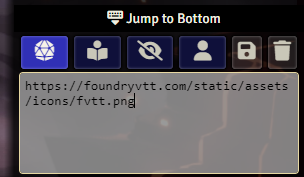
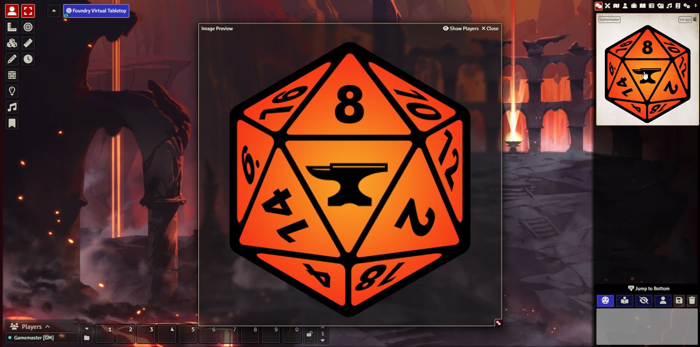

# FoundryVTT Chat Image Preview

This module embeds images from chat messages directly into the chat log. When an embedded image is clicked, it will open in an image viewer.

## Table of Contents

- [Installation](#installation)
- [Usage](#usage)

## Installation

To install the module, paste the following manifest URL into the Install Module dialog in FoundryVTT:

```url
https://github.com/thyzerle/fvtt_chatimagepreview/releases/latest/download/module.json
```

## Usage

The module will automatically embed images from chat messages into the chat log. When an embedded image is clicked, it will open in an image viewer.
This will not work retroactively, only for new messages. After uninstalling the module, the images will still be embedded in the chat log but will not be clickable anymore.

 

The above image will be embedded in the chat log as shown below:


Clicking on the image will open it in an image popup. \
Clicking while holding the `Ctrl` key will open the image in a new tab.


